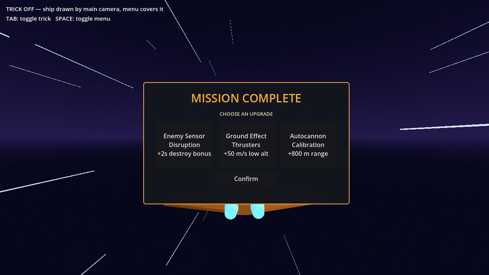
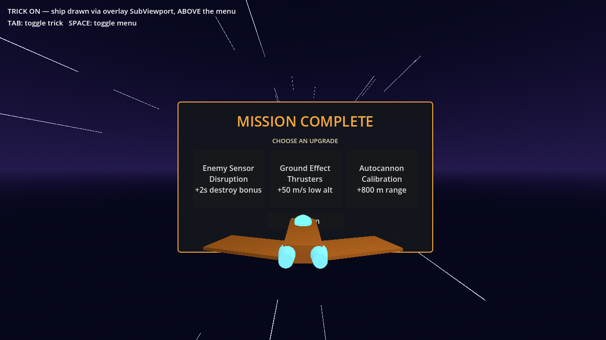

# Ship Overlay Demo

A tiny Godot 4 demo of rendering a 3D object **on top of** UI — here, a spaceship
that stays in front of a "between levels" menu instead of being covered by it.

Godot draws all 3D below all `CanvasLayer`s, so a naive scene can't ever put the
ship above the menu:

| Trick off — menu covers the ship | Trick on — ship painted above the menu |
| --- | --- |
|  |  |

## Running it

Open the project in Godot 4.6+ and press Play.

- **TAB** — toggle the trick on/off to compare
- **SPACE** — show/hide the menu

## How it works

The menu stays a plain `CanvasLayer` (layer 1). You don't fight the layering —
you add another layer on top of it and re-paint just the ship into the 2D stack:

1. Put the ship's meshes on their own **render layer** (layer 2 here).
2. Add a `CanvasLayer` with a **higher** layer number than the menu (layer 2 vs 1).
   Under it: `SubViewportContainer` → `SubViewport` with `transparent_bg = true`.
   A `SubViewport` shares the main scene's `World3D` by default, so it renders
   the *same* ship — no copy.
3. Inside that `SubViewport`, a second `Camera3D` whose **cull mask is only the
   ship's render layer**, glued to the main camera every frame
   (`global_transform` + `fov`) so the ship lands on exactly the same pixels.
4. When the menu opens, flip the ship's layer **off** the main camera's cull mask
   and show the overlay layer. Undo both when the menu closes.

```
ShipOverlayDemo (Node3D)          ← ship_overlay_demo.gd
├── MainCamera (Camera3D)         ← renders the world; ship layer toggled off while menu is up
├── Ship (Node3D)                 ← all MeshInstance3Ds on render layer 2
├── ShipLight (OmniLight3D)       ← layers = 2, light_cull_mask = 2 (see gotcha #1)
├── MenuLayer (CanvasLayer, layer 1)
│   └── the menu UI
└── ShipOverlayLayer (CanvasLayer, layer 2)
    └── SubViewportContainer (stretch, full rect, mouse_filter = IGNORE)
        └── ShipViewport (SubViewport, transparent_bg)
            └── OverlayCamera (Camera3D, cull_mask = layer 2 only)
```

The main camera keeps rendering the whole game (enemies and all) the entire
time; the overlay camera only ever sees the ship, and only while the menu is
up. No camera swap. The menu itself has no camera — it's ordinary 2D UI.

One caveat: while the overlay is active the ship composites on top of
*everything*, so a world object passing between the camera and the ship would
go behind it. Between levels that's usually exactly what you want.

## Gotchas

Two things that will eat your afternoon:

- **A cull-masked camera culls lights too.** `Light3D` is a `VisualInstance3D`
  sitting on render layer 1 by default, so the ship-only overlay camera drops
  every light in the scene and renders the ship ambient-only — a near-black
  silhouette that looks exactly like a color-space bug. Set the light's
  `layers` (not just `light_cull_mask`) to include the ship's render layer.
- **The transparent viewport doesn't render the sky**, so metallic materials
  lose their sky reflections and go dull. Use non-metallic materials on the
  overlaid object, or give it a dedicated light masked to its layer so it looks
  identical in both paths.

## Regenerating the screenshots

```sh
godot --path . res://capture.tscn
```

writes `docs/before.png` and `docs/after.png`, then quits.

## License

[MIT](LICENSE)
